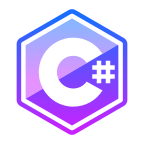

<h1>
    
    Maicon Dutra
</h1>

<h3>Sobre mim</h3>

Sou um <strong>Desenvolvedor Backend</strong> atualmente cursando Engenharia de Software, estando no terceíro período. Minha área de atuação é o backend, utilizando C#, .NET, TypeScript, Angular, MySQL, Nest.js, porém tenho conhecimentos em frontend também, tal como HTML, CSS, Bootstrap, Javascript.
 
 
 

  
  

  

       
    <h1>HardSkills</h1>
    
    
    
    
    
    
       
    
    
    
    
    
  

   
   

    
<h1 align="center">Contato</h1>

